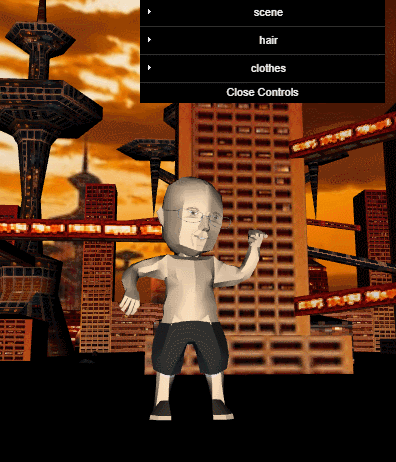

# GLAVATAR Demo

## Demo





This is a temporary demo built on minimal-gltf-loader and ugly raw webgl code.

```
npm install
```

* hack fix for dat.GUI

after doing `npm install` (from the project root dir), 
modify the `main` in `node_modules/dat.gui/package.json` from `index.js` to `build/dat.gui.min.js`


Launch the dev-server via
```
npm run dev-server
```

And goto `localhost:7000` in browser.


## Credits

* Batman VS Superman Suit by Valentin Yovchev is licensed under CC Attributio (modified with blender) [link](https://sketchfab.com/models/35e9fbd6dc3b4fa8a8cc469cc1a16393#)
* VC from [glTF sample Models](https://github.com/KhronosGroup/glTF-Sample-Models/tree/master/2.0/VC)
* [minimal-gltf-loader](https://github.com/shrekshao/minimal-gltf-loader) by @shrekshao